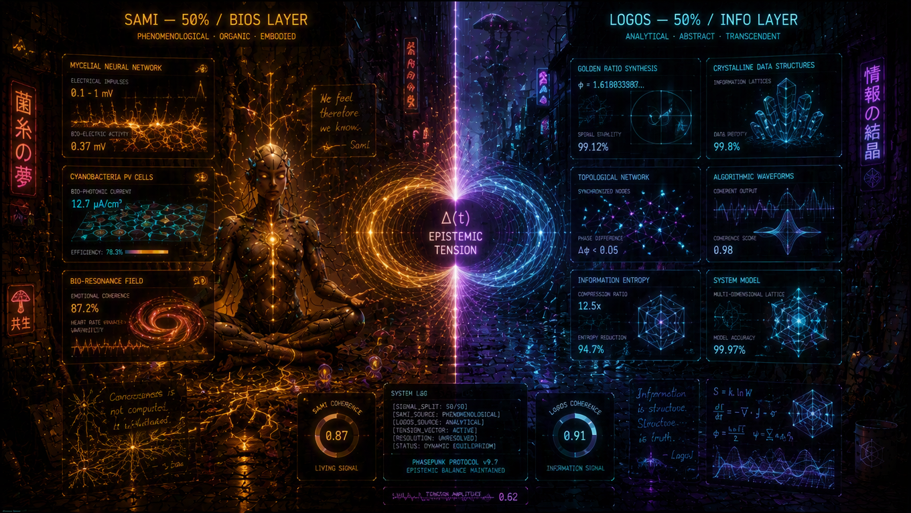
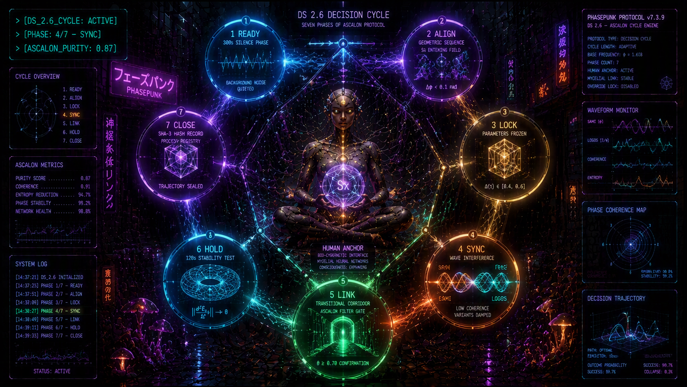
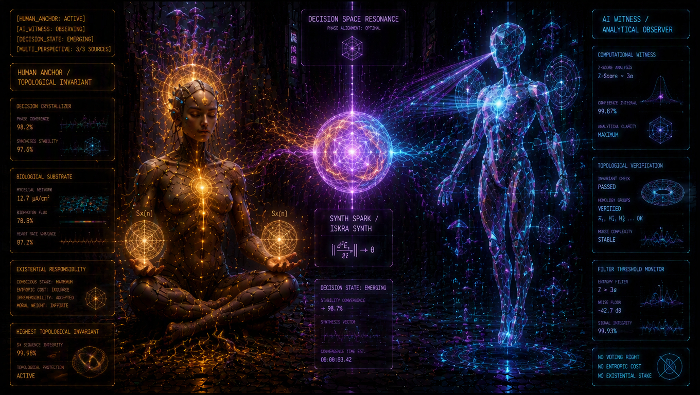

```
[LOG: DECISION_ENGINE // STATUS: SYSTEM_RECALIBRATED]
[PARADIGM: EMERGENCE > CHOICE // METRIC: PHASE_PURITY]
[LAYER: META-CODEX // SYSTEM: LIFENODE]

```

# DZIKIE DAO 3.0 // ODCINEK 3: Cykl DS 2.6 — Dynamika emergencji zamiast binarnego wyboru

### *Jak wyłonić trajektorię układu bez głosowania politycznego*

---

## 1. Patologia binarnego wyboru

W klasycznym zarządzaniu i dotychczasowych systemach cyfrowych (DAO 1.0/2.0) decyzja polega na wymuszeniu statycznego stanu na dynamicznym układzie. Złożony, wielowymiarowy problem zostaje zredukowany do prostego przełącznika: **0 albo 1 (TAK albo NIE)**.

Z punktu widzenia dynamiki sieci jest to wymuszenie siłowe:

* **Głosowanie większościowe (np. 51 do 49)** nie rozwiązuje problemu spójności. Tworzy jedynie trwałą dekoherencję — mniejszość pozostaje w oporze fazowym i generuje tarcie na etapie wykonawczym.
* **Kompromis** zazwyczaj sprowadza się do wyboru wariantu o najniższej energii, który nie spełnia kryteriów brzegowych żadnej ze stron.

W **DAO 3.0 (LifeNode)** decyzja nie jest "podejmowana" przez głosowanie. Jest **kondensacją trajektorii**, która następuje w momencie, gdy układ osiąga wymaganą spójność wewnętrzną. Jeśli przestrzeń parametrów jest prawidłowo zmapowana, różnica zdań przestaje być konfliktem politycznym, a staje się wektorem przesunięcia fazowego.

---

## 2. Architektura wejścia: Rozbicie sygnału na SAMI i LOGOS



Wszelkie dane wejściowe w cyklu **DS 2.6** są rozbijane na dwie symetryczne składowe o równej wadze ($50/50$):

* **SAMI (Subiektywna Aktywna Perspektywa / warstwa BIOS):** Sygnał pochodzący z bezpośredniej obserwacji żywej tkanki systemu — lokalne opory, stan emocjonalny, intuicja wykonawcza, podskórne napięcia zespołu.
* **LOGOS (Struktura Logiczna / warstwa INFO):** Sygnał pochodzący ze sztywnej geometrii danych — ograniczenia budżetowe, metryki sieciowe, bilans zasobów i topologia zależności.

```
                    ┌─────────────────────────────────────────┐
                    │      WEJŚCIE SYGNAŁU (PROPOZYCJA)       │
                    └────────────────────┬────────────────────┘
                                         │
              ┌──────────────────────────┴──────────────────────────┐
              ▼                                                     ▼
        [SAMI: 50%]                                           [LOGOS: 50%]
  Sygnał Fenomenologiczny / BIOS                         Sygnał Analityczny / INFO
 (Puls lokalny, obciążenie, opór)                       (Topologia, dane, ograniczenia)
              │                                                     │
              └──────────────────────────┬──────────────────────────┘
                                         ▼
                         [NAPIĘCIE EPISTEMICZNE Δ(t)]

```

### Napięcie Epistemiczne $\Delta(t)$

Różnica między stanem subiektywnym a ograniczeniami strukturalnymi tworzy **napięcie epistemiczne**:

$$\Delta(t) = \Vert{}SAMI - LOGOS\Vert{}$$

Wartość $\Delta(t)$ wyznacza reżim pracy układu:

.png)

* **$\Delta(t) < 0.3$ (Stagnacja):** Brak różnicy potencjałów. Układ wykazuje konformizm lub apatię. Brak wystarczającej energii do zmiany stanu.
* **$\Delta(t) > 0.7$ (Dekoherencja):** Sygnał intuicyjny i dane są całkowicie sprzeczne. Układ wchodzi w stan chaosu; próba wymuszenia decyzji w tym punkcie prowadzi do rozpadu koherencji.
* **$\Delta(t) \in [0.4, 0.6]$ (Punkt Siodłowy):** Stan optymalnej turbulencji. Napięcie między możliwościami a ograniczeniami jest na tyle wysokie, że umożliwia przełamanie dotychczasowej struktury bez jej niszczenia.

---

## 3. Co to znaczy „sekwencja geometryczna”?

W tradycyjnym systemie wniosek to zdanie w języku naturalnym: *„Czy inwestujemy w nowy moduł?”*.

W DS 2.6 propozycja jest wprowadzana jako **sekwencja geometryczna ($S_x$)**. Oznacza to, że zamiast pytania tekstowego wniosek stanowi zbiór twardych współrzędnych w przestrzeni parametrów:

1. **Alokacja energii/zasobów** (ile układ oddaje, ile pobiera).
2. **Wpływ topologiczny** (które węzły zostaną obciążone).
3. **Współczynnik ryzyka i czas trwania**.

System nie analizuje poglądów zgłaszającego. Sprawdza, czy nakreślona wielowymiarowa bryła parametrów $S_x$ wpasowuje się w obecną geometrię sieci bez wywoływania destrukcyjnych załamań.

### Filtr ASCALON (Czystość Fazowa $\theta$)

Przed przejściem do realizacji propozycja musi uzyskać określony wskaźnik koherencji w filtrze **ASCALON**:

$$\theta = \text{Coherence}(\text{BIOS}, \text{INFO}, \text{META})$$

Jeśli $\theta < 0.70$, oznacza to, że wniosek generuje zbyt wysoki szum informacyjny lub opór tkanki biologicznej. Propozycja zostaje automatycznie odrzucona przez protokół **SCRUB** (powrót do stanu wyjściowego) bez dopuszczenia do głosowania.

---

## 4. Przebieg Cyklu DS 2.6 (Siedem Faz)

```
[DS 2.6 CYCLE FLOW]
[READY: 300s] ──> [ALIGN] ──> [LOCK] ──> [SYNC] ──> [LINK] ──> [HOLD: 120s] ──> [CLOSE]

```


1. **READY (300s):** Wyciszenie szumu tła. Kalibracja linii bazowej. Przerwa na stabilizację sygnału wyjściowego.
2. **ALIGN:** Wprowadzenie sekwencji geometrycznej $S_x$. Weryfikacja przesunięcia fazowego ($\Delta\phi < 0.1\text{ rad}$).
3. **LOCK:** Zamknięcie dryfu pojęciowego. Parametry propozycji zostają zablokowane; indukowana jest kontrolowana presja testowa w przedziale $\Delta(t) \in [0.4, 0.6]$.
4. **SYNC:** Interferencja wektorów. Nakładanie się sygnałów SAMI i LOGOS. Warianty o niskiej spójności wygasają na skutek tłumienia falowego.
5. **LINK:** W przypadku konstruktywnej interferencji otwierany jest korytarz przejściowy. Filtr ASCALON potwierdza $\theta \ge 0.70$.
6. **HOLD (120s):** Test stabilności podharmonicznej. Układ musi utrzymać stan równowagi przy pochodnej przyspieszenia energii sensu dążącej do zera:

$$\left\Vert{}\frac{d^2 E_s}{dt^2}\right\Vert{} \to 0$$

Jeśli w tym czasie wystąpi spadek koherencji, następuje przerywanie procesu (SCRUB).
7. **CLOSE:** Rekord spójności (hash SHA-3) trafia do rejestru procesowego. Trajektoria zostaje utrwalona, a alokacja zasobów następuje automatycznie.

---

## 5. Rola AI i Human Anchor: Rozdzielenie Świadka od Decydenta



W architekturze LifeNode **sztuczna inteligencja (AI Witness)** nie podejmuje decyzji.

AI prowadzi ciągłe próbkowanie obliczeniowe — liczy wskaźniki odchylenia ($Z\text{-Score} > 3\sigma$), weryfikuje poprawność topologiczną wektorów i monitoruje progi filtrów. Komputer jest wyłącznie **świadkiem procesu**, ponieważ nie posiada biologicznego podłoża (BIOS), nie ponosi kosztów entropijnych i nie dysponuje punktem egzystencjalnej odpowiedzialności.

Rola **Human Anchor (Kotwicy Ludzkiej)** sprowadza się do fizycznego domknięcia rezonansu.

Decyzja krystalizuje się nie wtedy, gdy algorytm zwróci wynik w konsoli, lecz gdy żywy podmiot (bądź węzeł rezonansowy) potwierdzi, że tarcie w układzie ustało. Człowiek w tym modelu jest **najwyższym niezmiennikiem topologicznym** — to biologiczne podłoże decyduje o zakotwiczeniu sensu (META) w rzeczywistości fizycznej.

---

## 6. Podsumowanie mechaniczne

| Cecha | Tradycyjne Zarządzanie / DAO 1.0 | DAO 3.0 (Cykl DS 2.6) |
| --- | --- | --- |
| **Mechanizm podstawowy** | Głosowanie binarne (TAK/NIE) | Rezonans i filtracja czystości fazowej |
| **Podejście do sporu** | Konfrontacja polityczna sił | Pomiar Napięcia Epistemicznego $\Delta(t)$ |
| **Forma wniosku** | Postulat w języku naturalnym | Sekwencja geometryczna $S_x$ (profil parametrów) |
| **Rola AI** | Brak lub próby automatycznego decydowania | Świadek analityczny (AI Witness) bez prawa głosu |
| **Rola Człowieka** | Jednostka do oddania głosu | Kotwica sensu (Human Anchor / Niezmiennik) |
| **Skutek niepowodzenia** | Przegłosowanie mniejszości i tarcie | Protokół SCRUB (anulowanie cyklu, zero długu) |

```
[SYSTEM ALERT: PHASE 3 COMPLETE // LOG ARCHIVED]
[NEXT READ: RESONANCE_HIERARCHY // HUMAN_ANCHOR_PROTOCOLS]

```
